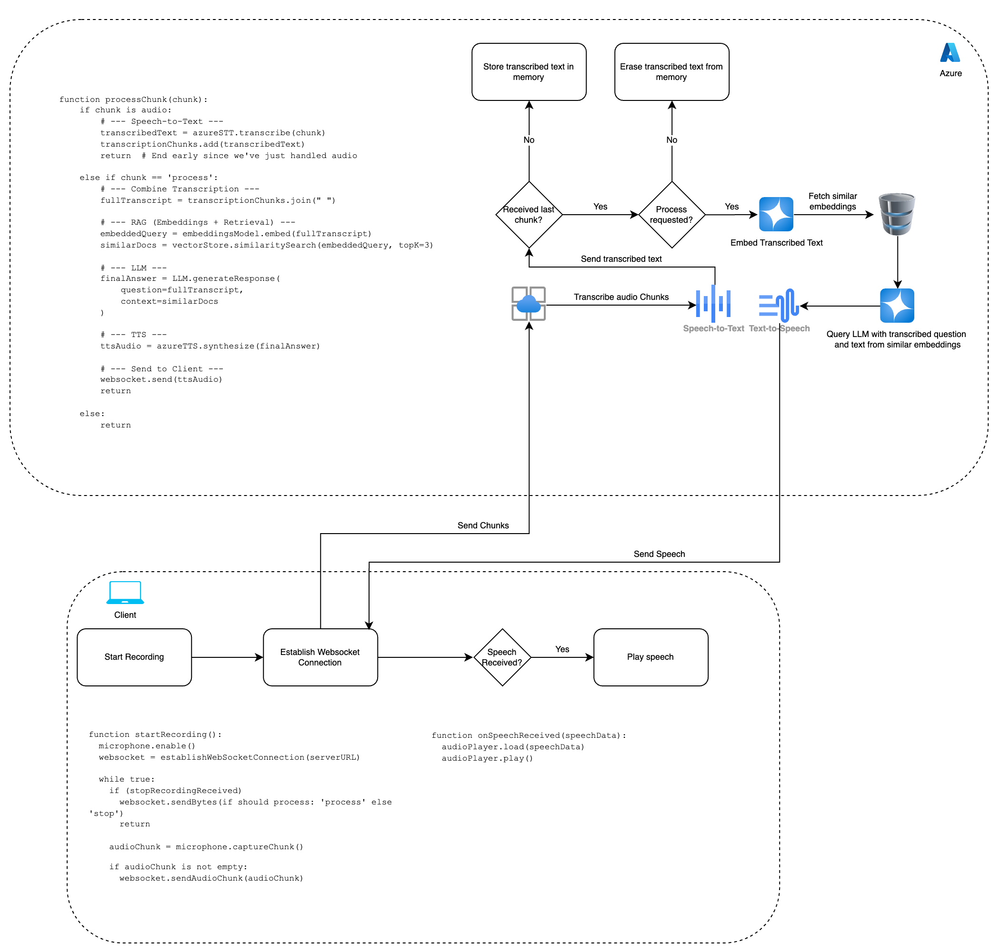

# DESIGNTK 531 Midterm - Live Question-Answering Assistant

Imagine you’re giving a presentation and someone from the audience asks you a question. Thankfully, you have our Live Question-Answering Assistant. The system captures the question in real time, transcribes it, and retrieves relevant information from your knowledge base. It then uses a GPT model to craft an answer, converts that answer to speech, and whispers it back into your ear—allowing you to respond confidently on the spot.

---

## How It Works

1. **Audio Capture**  
   - While you speak or listen to an audience question, the system captures audio through your laptop's microphone.
   - Audio chunks are sent via WebSocket to the backend for processing.

2. **Transcription (Speech-to-Text)**  
   - Each audio chunk is transcribed using Whisper deployed on Azure.

3. **Retrieval-Augmented Generation (RAG)**  
   - Once the question is transcribed, the system embeds the text and searches your custom knowledge base for relevant documents or context.

4. **GPT Query**  
   - The transcribed question and retrieved context are passed to an LLM (e.g., GPT-4). 
   - The LLM generates a concise, helpful answer, tailored to your knowledge base.

5. **Text-to-Speech (TTS)**  
   - The LLM response is converted into spoken audio (TTS). 
   - This audio is sent back through the WebSocket.

6. **Earbud Playback**  
   - The system delivers the synthesized answer privately to your AirPods, so you can hear the solution discreetly and respond verbally to the audience.

---

## System Diagram

Below is a simplified diagram illustrating the flow of data:

1. **Client (Your Laptop)**  
   - **Start Recording:** Captures live audio from the question being asked.  
   - **Send Audio Chunks:** Streams them to the backend over a WebSocket.  
   - **Receive Answer Audio:** Plays it in your ear, discreetly.

2. **Backend (Azure Services)**  
   - **Speech-to-Text (STT):** Converts audio chunks to text.  
   - **RAG:** Uses embeddings + a vector database to find relevant context.  
   - **GPT Model:** Takes the question + context to produce an answer.  
   - **Text-to-Speech (TTS):** Converts the final text answer to audio.  
   - **Send Audio to Client:** Returns synthesized speech for you to hear.

3. **Decision Logic**  
   - **Process Command:** If you want the system to generate an answer, it runs RAG + GPT.

---

## Data Flow Summary

1. **Audio In**: Laptop → Audio chunks → WebSocket → Backend  
2. **Transcription**: Audio → Whisper → Text  
3. **Retrieval**: Embeddings + Vector DB → Relevant info from your knowledge base  
4. **GPT**: Question + Context → Final text answer  
5. **TTS**: Final text → Speech  
6. **Audio Out**: Backend → WebSocket → Laptop

---